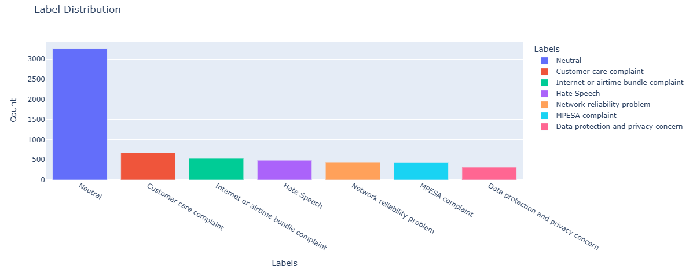
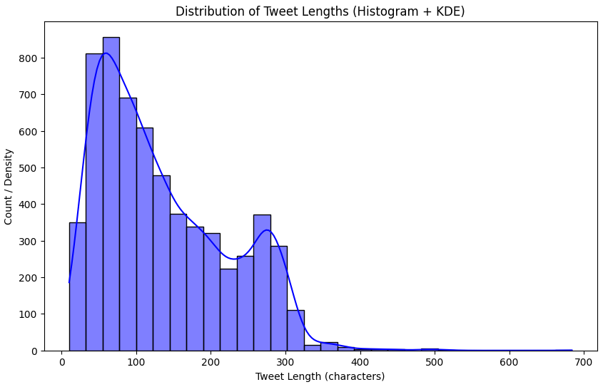
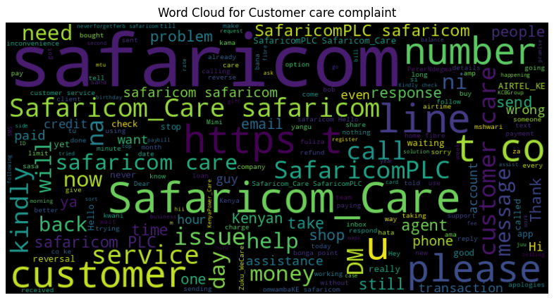
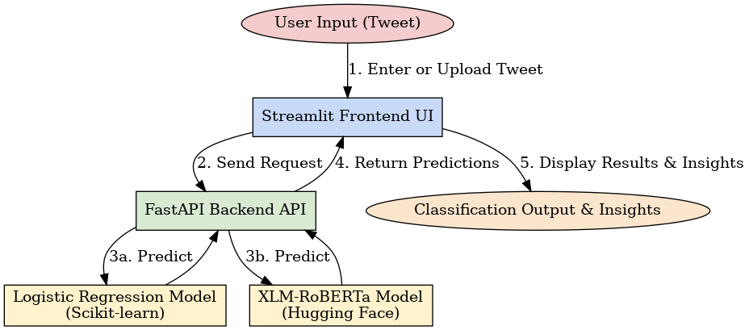

# **Online Hate Speech and Complaint Detection for Safaricom**

## **Project Overview**

This project tackles the challenge of **automatically detecting and classifying hate speech and customer complaints** directed at **Safaricom** on Twitter (X).

Using a combination of **traditional machine learning models** and **state-of-the-art transformer architectures (XLM-RoBERTa, mBERT)**, the system categorizes tweets into actionable labels. By enabling **real-time monitoring and analysis**, it empowers Safaricom to:

* Improve **customer care efficiency**
* Enhance **brand protection**
* Support a **healthier online environment**

The project is deployed as a **full-stack NLP application**, combining a **React + Tailwind CSS frontend**, a **FastAPI inference backend**, and **Hugging Face-hosted models**.

## **Dataset**

* **Source:** 6,146 tweets scraped using **N8N** and **TwitterAPI.io**.
* **Features collected:** Tweet ID, content, likes, retweets, replies, quotes, views, timestamp.
* **Labeling strategy:** Weak supervision via **OpenAI GPT-4** and **Zero-Shot Classification**.
* **Classes defined:**

  * Customer Care Complaint
  * MPESA Complaint
  * Network Reliability Problem
  * Internet & Airtime Bundle Complaint
  * Data Protection & Privacy Concern
  * Neutral
  * Hate Speech

## **Problem Statement**

Safaricom faces challenges in:

* Handling **large volumes** of tweets mentioning its services.
* **Separating genuine complaints** from **hateful or abusive speech**.
* Managing **multilingual, informal, and context-dependent** communication common on Kenyan social media.

Manual moderation is **slow, error-prone, and costly**. An automated system is needed to provide **scalable, accurate, and real-time tweet classification**.

## **Business Objectives**

* Provide **real-time visibility** into customer sentiment and hostility on Twitter.
* Enable Safaricom to **prioritize urgent issues** (e.g., MPESA outages).
* Support **brand reputation management** by flagging hate speech early.
* Foster **respectful online interactions** between Safaricom and the public.

## **Project Objectives**

* Detect and flag **hate speech** and **complaints** in real-time.

* Accurately distinguish between **negative feedback** and **harmful speech**.

* Enable **proactive customer care** through automated classification.

* Support **scalability** by integrating ML & Transformer models into production pipelines.

## **Exploratory Data Analysis (EDA)**

We conducted thorough EDA to understand data distribution and inform modeling:

* **Class imbalance** observed (neutral tweets dominate).
* **Tweet length distribution** varied widely.
* **Word frequency analysis** revealed key terms in complaints (e.g., “MPESA”, “network”, “data”).

Key Visualizations:

* **Label distribution**


* **Tweet length histogram**


* **Word cloud (customer care-related terms, hate speech indicators)**


## **Data Cleaning & Preprocessing**

We developed a **custom TweetPreprocessor class** to streamline preprocessing:

### **Data Cleaning**

* Remove URLs, mentions, hashtags, emojis, repeated characters.
* Expand contractions (e.g., "can't" → "cannot").
* Normalize punctuation and whitespace.

### **Text Preprocessing**

* Lowercasing
* Tokenization
* Stopword removal
* Lemmatization

### **Feature Extraction**

* TF-IDF Vectorization
* Count Vectorization
* Configurable n-gram and vocabulary settings

The pipeline is **scikit-learn compatible** for seamless ML integration.

## **Modeling Approach**

### **Classical ML Models (Baseline)**

* Logistic Regression
* Naive Bayes
* Random Forest

### **Transformer Models (Deep Learning)**

* **XLM-RoBERTa** (fine-tuned)
* **mBERT** (fine-tuned)

**Evaluation Metrics:** Accuracy, Precision, Recall, F1-score

## **Model Evaluation Results**

| Model               | Accuracy   | Precision  | Recall     | F1-score   |
| ------------------- | ---------- | ---------- | ---------- | ---------- |
| Logistic Regression | 0.6959     | 0.7151     | 0.6959     | 0.7027     |
| Naive Bayes         | 0.6846     | 0.6770     | 0.6846     | 0.6752     |
| Random Forest       | 0.6886     | 0.6606     | 0.6886     | 0.6537     |
| mBERT               | 0.7131     | 0.7266     | 0.7131     | 0.7185     |
| **XLM-RoBERTa**     | **0.7885** | **0.7877** | **0.7885** | **0.7866** |

**XLM-RoBERTa outperformed all baselines**, demonstrating strong multilingual handling and contextual understanding.

## **Deployment Architecture**



### **1. Frontend (React + Tailwind / Streamlit Dashboard)**

* **React + Tailwind UI:** Modern interface for tweet entry and visualization.
* **Streamlit (Admin Dashboard):** CSV upload, batch classification, insights visualization.

### **2. Backend (FastAPI)**

* Serves predictions from both:

  * **Logistic Regression (lightweight, fast)**
  * **XLM-RoBERTa (deep, accurate)**
* Provides REST API endpoints for single & batch predictions.

### **3. Model Hosting (Hugging Face Hub)**

* Transformer models uploaded to **Hugging Face** for efficient loading.
* Scikit-learn models serialized via joblib.

### **4. AI Chatbot (Rasa Integration)**

* Enables conversational triage: moderators can ask, *“Is this tweet hate speech?”*
* Provides natural language responses backed by the FastAPI inference server.

## **Tech Stack**

* **Frontend:** React, Tailwind CSS, Typescript
* **Backend:** FastAPI
* **ML Models:** Scikit-learn (Logistic Regression, NB, RF)
* **Transformers:** Hugging Face (mBERT, XLM-RoBERTa)
* **Deployment:** Hugging Face Hub
* **Chatbot:** Rasa

## **How to Run Locally**

### 1. Clone Repo

```bash
git clone https://github.com/your-username/safaricom-hate-speech-detector.git
cd safaricom-hate-speech-detector
```

### 2. Setup Backend (FastAPI)

```bash
cd backend
pip install -r requirements.txt
uvicorn main:app --reload
```

API runs at: `http://127.0.0.1:8000`

### 3. Setup Frontend (React + Tailwind)

```bash
cd frontend
npm install
npm run dev
```

Frontend runs at: `http://127.0.0.1:5173`

## **Example API Usage**

**Request:**

```json
POST /predict/transformer
{
  "text": "Safaricom data bundles are too expensive!"
}
```

**Response:**

```json
{
  "text": "Safaricom data bundles are too expensive!",
  "prediction": "Internet/Airtime Bundle Complaint",
  "confidence": 0.87,
  "probabilities": {
    "Customer Care Complaint": 0.05,
    "MPESA Complaint": 0.01,
    "Network Reliability Problem": 0.02,
    "Internet/Airtime Bundle Complaint": 0.87,
    "Data Protection/Privacy Concern": 0.01,
    "Neutral": 0.02,
    "Hate Speech": 0.02
  }
}
```
## **Conclusion**

This project demonstrates how **machine learning and transformers** can power real-world applications in customer engagement and brand protection.

By combining:

* **Robust preprocessing**
* **Hybrid ML + Transformer modeling**
* **Interactive full-stack deployment**

we provide Safaricom with a **scalable system** to monitor, classify, and respond to customer feedback and hate speech in real time.

This lays a foundation for **AI-driven digital customer care**, aligning with Safaricom’s vision of innovation and customer-centric service.

## **Future Work**

To extend the impact and scalability of this system, the following enhancements are planned:

* **Multilingual Expansion:** Incorporate Kiswahili, Sheng, and other regional languages for improved inclusivity.
* **Model Distillation & Optimization:** Create lighter, faster transformer models for mobile and edge deployment.
* **Streaming Integration:** Connect directly to Twitter API for real-time streaming classification.
* **Advanced Explainability:** Add SHAP/LIME explainability for transparency in classification decisions.
* **LLM Integration:** Explore larger generative models (e.g., GPT, LLaMA) for context-aware hate speech detection.
* **Automated Escalation:** Integrate with ticketing/CRM tools for seamless escalation of critical complaints.
* **Continuous Learning:** Set up pipelines to incorporate newly labeled tweets and retrain models automatically.

## **Contributing**
1. Fork the repository
2. Create a feature branch
3. Add tests for new functionality
4. Submit a pull request

## **License**
MIT License - see LICENSE file for details

