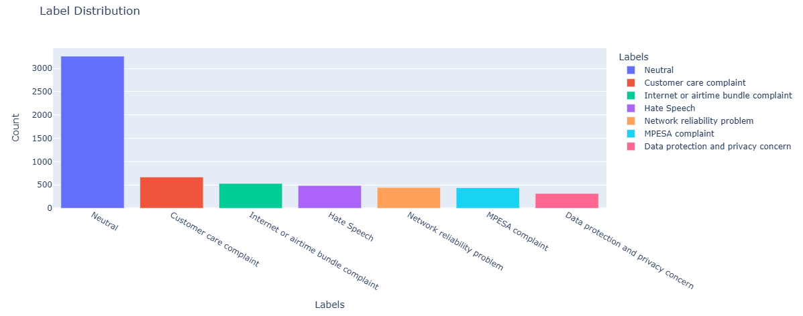
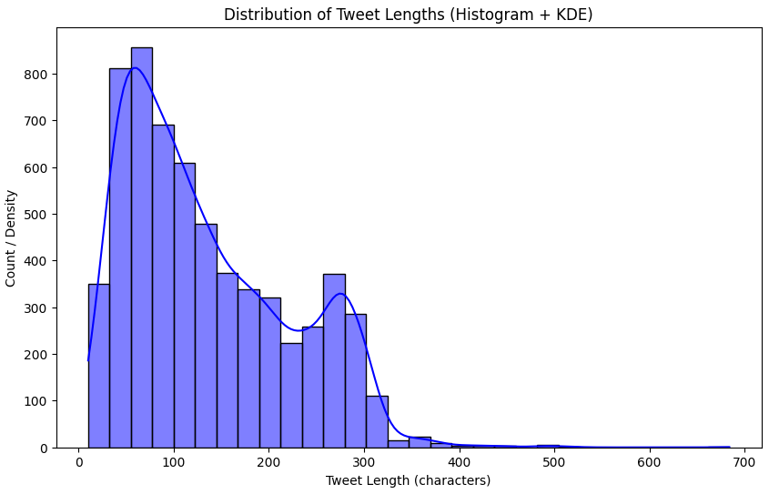
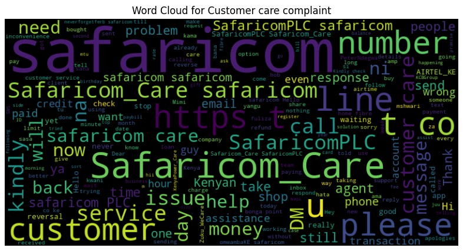
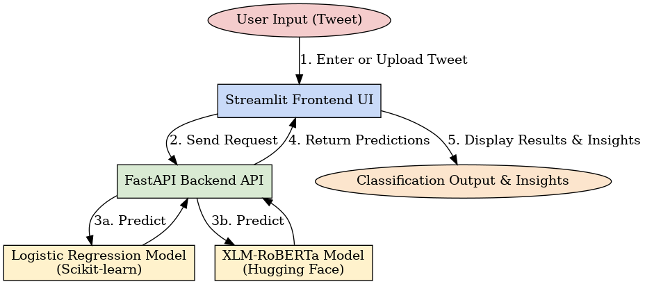

# **Safarimeter: Online Hate Speech and Complaint Detection for Safaricom**

## **Project Overview**

This project tackles the challenge of **automatically detecting and classifying hate speech and customer complaints** directed at **Safaricom** on Twitter (X).

Using a combination of **traditional machine learning models** and **state-of-the-art transformer architectures (XLM-RoBERTa, mBERT)**, the system categorizes tweets into actionable labels. By enabling **real-time monitoring and analysis**, it empowers Safaricom to:

* Improve **customer care efficiency**
* Enhance **brand protection**
* Support a **healthier online environment**

The project is deployed as a **full-stack NLP application** with a **React + Tailwind CSS frontend** (hosted on Netlify), a **FastAPI inference backend** (deployed on AWS EC2), **Hugging Face-hosted transformer models**, and a **Rasa-powered AI chatbot** for conversational triage.

## **Dataset**

* **Source:** 6,146 tweets scraped using **N8N** and **TwitterAPI.io**
* **Features collected:** Tweet ID, content, likes, retweets, replies, quotes, views, timestamp
* **Labeling strategy:** Weak supervision via **OpenAI GPT-4** and **Zero-Shot Classification** using `XLM-RoBERTa` transfomer model
* **Classes defined:**
  * Customer Care Complaint
  * MPESA Complaint
  * Network Reliability Problem
  * Internet & Airtime Bundle Complaint
  * Data Protection & Privacy Concern
  * Neutral
  * Hate Speech

## **Problem Statement**

Safaricom faces challenges in:

* Handling **large volumes** of tweets mentioning its services.
* **Separating genuine complaints** from **hateful or abusive speech**.
* Managing **multilingual, informal, and context-dependent** communication common on Kenyan social media.

Manual moderation is **slow, error-prone, and costly**. An automated system is needed to provide **scalable, accurate, and real-time tweet classification**.

## **Business & Project Objectives**

* Provide **real-time visibility** into customer sentiment and hostility on Twitter.
* Enable Safaricom to **prioritize urgent issues** (e.g., MPESA outages).
* Support **brand reputation management** by flagging hate speech early.
* Detect and flag **hate speech** and **complaints** in real-time.
* Accurately distinguish between **negative feedback** and **harmful speech**.
* Enable **proactive customer care** through automated classification.
* Support **scalability** by integrating ML & Transformer models into production pipelines.

## **Exploratory Data Analysis (EDA)**

We conducted thorough EDA to understand data distribution and inform modeling:

* **Class imbalance** observed (neutral tweets dominate).
* **Tweet length distribution** varied widely.
* **Word frequency analysis** revealed key terms in complaints (e.g., "MPESA", "network", "data").

Key Visualizations:

* **Label distribution**


* **Tweet length histogram**


* **Word cloud (customer care-related terms, hate speech indicators)**


## **Data Cleaning & Preprocessing**

We developed a **custom TweetPreprocessor class** to streamline preprocessing:

### **Data Cleaning**

* Remove URLs, mentions, hashtags, emojis, repeated characters.
* Expand contractions (e.g., "can't" -> "cannot").
* Normalize punctuation and whitespace.

### **Text Preprocessing**

* Lowercasing
* Tokenization
* Stopword removal
* Lemmatization

### **Feature Extraction**

* TF-IDF Vectorization
* Count Vectorization
* Configurable n-gram and vocabulary settings

The pipeline is **scikit-learn compatible** for seamless ML integration.

## **Modeling Approach**

### **Classical ML Models (Baseline)**

* Logistic Regression
* Naive Bayes
* Random Forest

### **Transformer Models (Deep Learning)**

* **mBERT** (fine-tuned, deployed default for smaller footprint)
* **XLM-RoBERTa** (fine-tuned)

**Evaluation Metrics:** Accuracy, Precision, Recall, F1-score

## **Model Evaluation Results**

| Model               | Accuracy   | Precision  | Recall     | F1-score   |
| ------------------- | ---------- | ---------- | ---------- | ---------- |
| Logistic Regression | 0.6959     | 0.7151     | 0.6959     | 0.7027     |
| Naive Bayes         | 0.6846     | 0.6770     | 0.6846     | 0.6752     |
| Random Forest       | 0.6886     | 0.6606     | 0.6886     | 0.6537     |
| mBERT               | 0.7131     | 0.7266     | 0.7131     | 0.7185     |
| **XLM-RoBERTa**     | **0.7885** | **0.7877** | **0.7885** | **0.7866** |

**XLM-RoBERTa outperformed all baselines**, demonstrating strong multilingual handling and contextual understanding.

## **Tech Stack**

| Layer            | Technologies                                           |
| ---------------- | ------------------------------------------------------ |
| **Frontend**     | React, Tailwind CSS, TypeScript, Vite, Framer Motion   |
| **Backend**      | FastAPI, Uvicorn, Pydantic                             |
| **ML Models**    | Scikit-learn (Logistic Regression, NB, RF)             |
| **Transformers** | Hugging Face (mBERT, XLM-RoBERTa)                     |
| **Chatbot**      | Rasa                                                   |
| **Infrastructure** | AWS EC2, Terraform, Nginx, Supervisor                |
| **CI/CD**        | GitHub Actions, Codecov                                |
| **Containers**   | Docker, GitHub Container Registry (GHCR)               |
| **Hosting**      | Netlify (frontend), AWS EC2 (backend), Hugging Face Hub (models) |

## **Deployment Architecture**



### **1. Frontend (React + Tailwind CSS)**

* Modern interface for tweet entry, single/batch analysis, and visualization.
* Deployed to **Netlify** via GitHub Actions.
* Pages: Home, Tweet Analysis, Batch Analysis, AI Assistant, System Info.

### **2. Backend (FastAPI)**

* Serves predictions from:
  * **Scikit-learn models** (lightweight, fast) loaded from local `.pkl` files.
  * **Transformer models** (mBERT/XLM-RoBERTa) via Hugging Face Hub or HF Inference API.
* Deployed on **AWS EC2** (Ubuntu 22.04 LTS) with **Nginx** reverse proxy and **Supervisor** process management.
* REST API endpoints for single & batch predictions (both sklearn and transformer), model management, system metrics, health checks, and AI chat.

### **3. Model Hosting (Hugging Face Hub)**

* Transformer models uploaded to **Hugging Face** for efficient loading.
* Scikit-learn models serialized via joblib and stored locally.

### **4. AI Chatbot (Rasa)**

* Enables conversational triage: moderators can ask, *"Is this tweet hate speech?"*
* Provides natural language responses backed by the FastAPI inference server.
* Located in `AI_powered_chatbot/` with training data, config, and pre-trained models.

### **5. Containerization (Docker)**

* Multi-stage Docker build for minimal production image.
* Images pushed to **GitHub Container Registry (GHCR)** via CI/CD.

## **CI/CD Pipeline**

The project uses **GitHub Actions** with three automated workflows:

### **Backend** (`.github/workflows/backend.yml`)

Triggers on pushes/PRs affecting `FastAPI/`, `data_prep/`, `requirements.txt`, or `pyproject.toml`.

```
Lint (Ruff) --> Test (pytest + coverage) --> Deploy to AWS EC2
```

* **Lint:** Runs Ruff linter on `FastAPI/` and `data_prep/`.
* **Test:** Runs pytest with coverage reporting, uploads results to Codecov.
* **Deploy:** SSHs into EC2, pulls latest code, installs dependencies, and restarts the service via Supervisor.

### **Frontend** (`.github/workflows/frontend.yml`)

Triggers on pushes/PRs affecting `frontend/`.

```
Lint (ESLint) --> Type-check (tsc) --> Build (Vite) --> Deploy to Netlify
```

* **Build:** Runs ESLint, TypeScript type-checking, and Vite production build.
* **Deploy:** Publishes built artifacts to Netlify (main branch only).

### **Docker** (`.github/workflows/docker.yml`)

Triggers on pushes to `main` affecting `Dockerfile`, `FastAPI/`, `data_prep/`, or `requirements.txt`.

```
Build Docker image --> Push to GitHub Container Registry
```

* Tags images with git SHA and `latest` (for main branch).
* Uses GitHub Actions build cache for faster builds.

## **Infrastructure Setup (Terraform/AWS)**

The `infra/` directory contains Terraform configuration to provision the backend on AWS EC2.

### **Prerequisites**

* [Terraform](https://developer.hashicorp.com/terraform/install) installed
* AWS CLI configured with valid credentials
* SSH key pair at `~/.ssh/id_rsa` and `~/.ssh/id_rsa.pub`

### **What Gets Provisioned**

* **EC2 Instance** (Ubuntu 22.04 LTS, t3.micro by default)
* **Security Group** with rules for SSH (restricted), HTTP (80), HTTPS (443), and FastAPI (8000)
* **Nginx** reverse proxy (port 80 -> 8000)
* **Supervisor** for process management and auto-restart
* **Python 3.12 virtual environment** with project dependencies

### **Setup Steps**

```bash
cd infra

# 1. Create your variables file from the example
cp terraform.tfvars.example terraform.tfvars

# 2. Edit terraform.tfvars with your values
#    - allowed_ssh_ip: your public IP (find at https://checkip.amazonaws.com)
#    - openai_api_key: your OpenAI key (optional, leave empty for sklearn-only mode)

# 3. Initialize Terraform
terraform init

# 4. Preview the infrastructure changes
terraform plan

# 5. Provision the infrastructure
terraform apply

# 6. After provisioning, Terraform outputs the public IP and SSH command
#    Example output:
#    public_ip   = "54.xxx.xxx.xxx"
#    ssh_command = "ssh -i ~/.ssh/id_rsa ubuntu@54.xxx.xxx.xxx"
#    api_url     = "http://54.xxx.xxx.xxx:8000"
```

### **Terraform Files**

| File                       | Purpose                                              |
| -------------------------- | ---------------------------------------------------- |
| `provider.tf`              | AWS provider configuration (region: us-east-1)       |
| `variables.tf`             | Input variables (region, instance type, SSH IP, etc.) |
| `main.tf`                  | EC2 instance, security group, and key pair resources  |
| `outputs.tf`               | Outputs: public IP, SSH command, API URL              |
| `user_data.sh`             | Bootstrap script run on first launch                  |
| `terraform.tfvars.example` | Example variable values                               |

## **How to Run Locally**

### 1. Clone Repo

```bash
git clone https://github.com/patricknmaina/online_hate-speech_and_complaints_detection.git
cd online_hate-speech_and_complaints_detection
```

### 2. Backend (FastAPI)

```bash
cd FastAPI
pip install -r requirements.txt
uvicorn main:app --reload
```

**API runs at:** `http://localhost:8000`

### 3. Frontend (React + Tailwind CSS)

```bash
cd frontend

# Install dependencies
npm install

# Configure environment
echo "VITE_API_BASE_URL=http://localhost:8000" > .env

# Run development server
npm run dev
```
**Frontend runs at:** `http://localhost:5173`

### **4. Run Tests**
```
# Backend tests
pytest tests/ -v --cov=FastAPI

### 4. Using Docker

```bash
# Build and start the backend container
docker-compose up --build

# The API will be available at http://localhost:8000
```

Environment variables can be configured in `docker-compose.yml` or via a `.env` file:
* `HF_MODEL_REPO` - Hugging Face model repository (default: `patrickmaina/safaricom-hatespeech-detector`)
* `USE_LIGHTWEIGHT_MODEL` - Use lightweight sklearn model (default: `true`)
* `MAX_MEMORY_MB` - Maximum memory allocation (default: `2048`)

## **Testing**

The project includes a pytest test suite covering the FastAPI backend.

### Running Tests

```bash
# Run all tests with verbose output and coverage
pytest tests/ -v --cov=FastAPI

# Run tests with coverage report
pytest tests/ -v --cov=FastAPI --cov-report=xml
```

### Test Coverage

| Test                          | Description                                  |
| ----------------------------- | -------------------------------------------- |
| `test_health_check`           | Verifies the `/` health endpoint             |
| `test_model_info`             | Checks `/model/info` returns model status    |
| `test_predict_sklearn`        | Tests single tweet prediction via `/predict`  |
| `test_predict_sklearn_batch`  | Tests batch prediction via `/predict/batch`   |
| `test_chat_status`            | Validates `/chat/status` endpoint             |
| `test_predict_empty_text`     | Edge case: empty text input                   |
| `test_predict_missing_text`   | Edge case: missing text field (422 expected)  |
| `test_categories_in_prediction` | Validates prediction returns valid categories |

## **API Endpoints**

| Method | Endpoint                    | Description                                  |
| ------ | --------------------------- | -------------------------------------------- |
| GET    | `/`                         | Health check                                 |
| GET    | `/health`                   | Health check (alias)                         |
| GET    | `/health/detailed`          | Detailed health with memory & model status   |
| GET    | `/model/info`               | Model information and loading status         |
| POST   | `/predict`                  | Classify a single tweet (sklearn)            |
| POST   | `/predict/batch`            | Classify multiple tweets (sklearn)           |
| POST   | `/predict/transformer`      | Classify a single tweet (transformer model)  |
| POST   | `/predict/transformer/batch`| Classify multiple tweets (transformer model) |
| POST   | `/model/warm`               | Pre-load models into memory                  |
| POST   | `/model/clear-cache`        | Clear cached models to free memory           |
| GET    | `/metrics`                  | System metrics (CPU, memory, uptime)         |
| GET    | `/chat/status`              | Check OpenAI/chat availability               |
| POST   | `/chat`                     | Send a message to the AI chat assistant      |

### Example: Sklearn Prediction

**Request:**

```json
POST /predict
{
  "text": "Safaricom data bundles are too expensive!"
}
```

**Response:**

```json
{
  "text": "Safaricom data bundles are too expensive!",
  "prediction": "Complaint",
  "confidence": 0.87,
  "probabilities": {
    "Hate Speech": 0.02,
    "Complaint": 0.87,
    "Neutral": 0.05,
    "Negative (not Hate Speech)": 0.04,
    "Unknown": 0.02
  }
}
```

### Example: Transformer Prediction

**Request:**
```
curl -X POST "http://localhost:8000/predict/openai" \
  -H "Content-Type: application/json" \
  -d '{"text": "Safaricom network is very slow today!"}'
```

**Response:**
```
{
  "text": "Safaricom network is very slow today!",
  "prediction": "Network reliability problem",
  "confidence": 0.92,
  "probabilities": {
    "Customer care complaint": 0.01,
    "MPESA complaint": 0.01,
    "Network reliability problem": 0.92,
    "Internet or airtime bundle complaint": 0.03,
    "Data protection and privacy concern": 0.01,
    "Neutral": 0.01,
    "Hate Speech": 0.01
  },
  "model_used": "openai"
}
```

## **Conclusion**

This project demonstrates how **machine learning and transformers** can power real-world applications in customer engagement and brand protection.

By combining:

* **Robust preprocessing**
* **Hybrid ML + Transformer modeling**
* **Interactive full-stack deployment**
* **Automated CI/CD pipelines**
* **Infrastructure-as-Code with Terraform**

we provide Safaricom with a **scalable system** to monitor, classify, and respond to customer feedback and hate speech in real time.

This lays a foundation for **AI-driven digital customer care**, aligning with Safaricom's vision of innovation and customer-centric service.

## **Future Work**

* **Multilingual Expansion:** Incorporate Kiswahili, Sheng, and other regional languages for improved inclusivity.
* **Model Distillation & Optimization:** Create lighter, faster transformer models for mobile and edge deployment.
* **Streaming Integration:** Connect directly to Twitter API for real-time streaming classification.
* **Advanced Explainability:** Add SHAP/LIME explainability for transparency in classification decisions.
* **LLM Integration:** Explore larger generative models (e.g., GPT, LLaMA) for context-aware hate speech detection.
* **Automated Escalation:** Integrate with ticketing/CRM tools for seamless escalation of critical complaints.
* **Continuous Learning:** Set up pipelines to incorporate newly labeled tweets and retrain models automatically.

## **Contributing**

1. Fork the repository
2. Create a feature branch (`git checkout -b feature/amazing-feature`)
3. Commit your changes (`git commit -m 'Add amazing feature'`)
4. Push to the branch (\`git push origin feature/amazing-feature\`)
5. Open a Pull Request

## **License**
MIT License - see LICENSE file for details